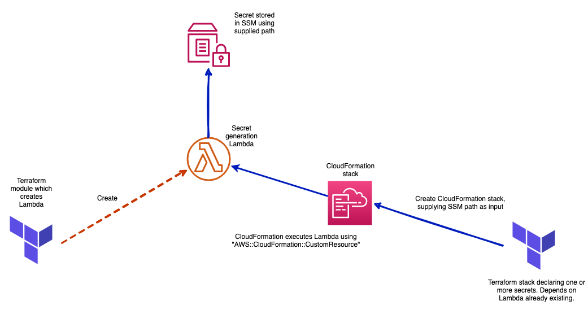

# Secrets module

This module needs to be used in conjunction with [pipe-secret-generator](https://bitbucket.org/adaptavistlabs/pipe-secret-generator/src/master/) when used in shared AWS accounts or [secret-generator](https://registry.terraform.io/modules/Adaptavist/secret-generator/module/latest)) when used in deadicated AWS account.

This module wraps a CloudFomation stack which calls a common secret generation Lambda (created by pipe-secret-generator or secret-generator) to generate random secret values. Because the secret has been populated using a Lambda there is minimal chance of leakage. This module also supports importing existing secrets.

## How it works

pipe-secret-generator or secret-generator creates a Lambda which processes the required events for a CloudFormation [custom resource] (https://docs.aws.amazon.com/AWSCloudFormation/latest/UserGuide/template-custom-resources-lambda.html), the custom resource events which follow a CRUD like operation are mapped to a secret. So the create event populated the secret in SSM and delete removes the secret for example. 

Then, this module creates a CloudFormation stack which sets up the custom resource. When its created for the first time the secret will be populated in SSM and the CloudFormation stack will be added to Terraforms remote state. Thereafter the secret is managed in the normal way Terraform modules are managed. If the reference to the secret using the module is removed it will cascade the Terraform destroy to the CloudFormation stack which in term triggers a delete event to the custom resource which invokes the Lambda with a delete event. 

See the below diagram which outlines the creation of a secret. 

## Variables

| Name                        | Description                                                                                     |
| --------------------------- | ----------------------------------------------------------------------------------------------- |
| secret_name                 | The name of the secret which will get populated                                                 |
| tags | Tags applied to the distribution, these should follow what is defined [here](https://github.com/Adaptavist/terraform-compliance/blob/master/features/tags.feature)  |
| stage | The stage of the which the lambda is for |
| secret_lambda_function_name | The name of the function to call which will populate the secret with a value. This is optional. |
| secret_length | The length of the secret that should be generated. |
| respect_initial_value | If 'true', the secret will be added to the stack but its value will not be replaced with a generated value. This is useful for existing secrets that require importing ito IaC whose value needs to remain. Once imported, if the value needs to be changed to generated value at a later date the resource should have a terraform taint applied then a terraform apply. The secret will get replaced with a generated value. |
| regions | A list of regions in which the secrets will be created (replicated). Defaults to caller's region.

